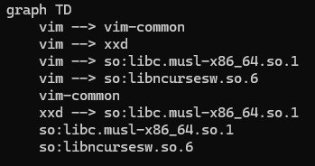

# Визуализация зависимостей пакетов Alpine Linux

## Общее описание

Этот проект предоставляет утилиту для анализа зависимостей пакетов Alpine Linux и визуализации их в формате Mermaid. Программа загружает индексы пакетов Alpine Linux, извлекает зависимости для указанного пакета и строит граф зависимостей с заданной глубиной. Результат сохраняется в файл, который можно использовать для графического представления.

## Описание функций и настроек

### Функции:

    1. parse_arguments(): Разбирает аргументы командной строки, задаваемые пользователем. 
    
    * Поддерживаются:
        
        - -p или --path: Путь к программе визуализации графа (в текущей реализации не используется).
        
        - -n или --name: Имя пакета для анализа.
        
        - -o или --output: Путь для сохранения выходного файла Mermaid.
        
        - -d или --depth: Максимальная глубина анализа зависимостей.

    2. download_apkindex(url): Загружает файл APKINDEX из указанного URL. Возвращает бинарные данные.

    3. parse_apkindex(data): Парсит содержимое APKINDEX и извлекает информацию о пакетах и их зависимостях.

    4. build_dependency_graph(packages, root_pkg, max_depth): Рекурсивно строит граф зависимостей для заданного пакета с учетом максимальной глубины.

    5. generate_mermaid_code(graph): Генерирует текстовое представление графа в формате Mermaid.

    6. main(): Главная функция, координирующая загрузку APKINDEX, построение графа зависимостей и сохранение результата.
        
### Настройки:

    - APKINDEX URLs: Предопределенные пути к файлам APKINDEX для версий Alpine Linux (v3.18 main и community репозитории).

    - Выходной файл: Результат работы программы записывается в файл, указанный в аргументе --output.
## Команды для сборки проекта

Этот проект написан на Python и не требует компиляции. Следуйте инструкциям для запуска:

    Убедитесь, что Python версии 3.7+ установлен.
    
    Установите необходимые библиотеки, если отсутствуют (в данном случае стандартные библиотеки Python).
    
    Запустите скрипт с аргументами:
```python
python script.py -p /path/to/visualizer -n <имя_пакета> -o <путь_к_файлу> -d <глубина>
```
## Результаты прогона тестов



